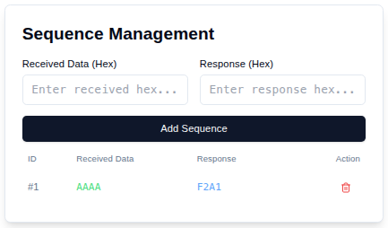
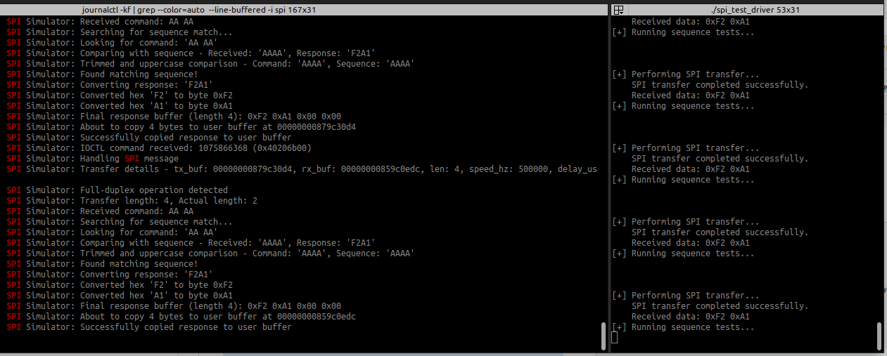

# Linux SPI Simulator

[🇹🇷 Türkçe versiyon için tıklayın](README_TR.md)

Linux SPI Simulator provides a configurable SPI driver system with a web interface that can be tested in virtual machines. This project can be used to simulate and test the SPI protocol.

## Features

- Web-based user interface
- Real-time SPI message monitoring
- Customizable SPI configuration
- Sequence-based response system
- Detailed logging and debugging

## System Requirements

- Linux operating system (Ubuntu 20.04 or higher recommended)
- Python 3.8 or higher
- Node.js 16 or higher
- Linux kernel headers
- Build tools (make, gcc, cmake)

## Installation

1. Install required packages:

```bash
sudo apt-get update
sudo apt-get install -y build-essential linux-headers-$(uname -r) python3-pip nodejs npm
```

2. Clone the project:

```bash
git clone https://github.com/haknkayaa/SPI_Simulator.git
cd spi-simulator
```

3. Install Python dependencies:

```bash
cd simulator/userspace
pip3 install -r requirements.txt
```

4. Install Frontend dependencies:

```bash
cd frontend
npm install
```

## Building

1. Build the kernel module:

```bash
cd ../../kernelspace
make
```

2. Build the frontend:

```bash
cd ../userspace/frontend
npm run build
```

## Running

1. Start the backend:

```bash
cd ../userspace
python3 app.py
```

2. Start the frontend (in a new terminal window):

```bash
cd frontend
npm run dev
```

3. Open `http://localhost:5173` in your browser.

## Usage

### Web Interface

The web interface consists of three main sections:

1. **Configuration Panel**
   - SPI device path
   - Bus number
   - Chip Select number
   - SPI speed
   - SPI mode
   - Bits per word

2. **Sequence Management**
   - Add new sequences
   - View existing sequences
   - Delete sequences
   - Import/export sequences

3. **Terminal**
   - Real-time log viewing
   - Command history
   - SPI messages

### Sending SPI Commands

1. Enter the command in hex format in the "Command Interface" section
2. Click the "Send" button
3. The response will be displayed in the terminal section

### Defining Sequences

1. In the "Sequence Management" section:
   - Enter the expected command in the "Received Data" field
   - Enter the response in the "Response" field
   - Click the "Add Sequence" button

## Screenshots


*Main screen view*



*Sequence management panel*



*Terminal and log viewing*

## Troubleshooting

### Common Issues

1. **Driver won't load**
   - Ensure kernel headers are installed
   - Check your sudo permissions
   - Check dmesg output

2. **Cannot access web interface**
   - Ensure backend and frontend services are running
   - Check for port conflicts
   - Check firewall settings

### Log Files

- Kernel logs: `dmesg | grep "SPI Simulator"`
- Backend logs: `simulator/userspace/app.log`
- Frontend logs: Browser developer console

## Contributing

1. Fork this repository
2. Create your feature branch (`git checkout -b feature/amazing-feature`)
3. Commit your changes (`git commit -m 'Add some amazing feature'`)
4. Push to the branch (`git push origin feature/amazing-feature`)
5. Open a Pull Request

## License

This project is licensed under the MIT License - see the [LICENSE](LICENSE) file for details.

## Contact

Hakan Kaya - [@haknkayaa](https://github.com/haknkayaa)

Project Link: [https://github.com/haknkayaa/SPI_Simulator](https://github.com/haknkayaa/SPI_Simulator) 
