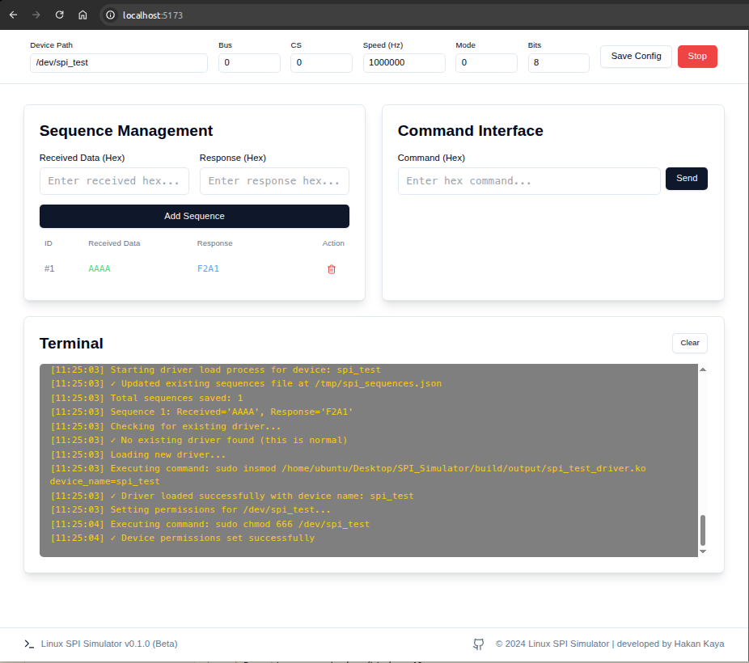
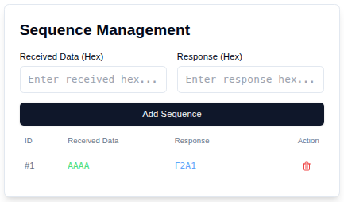

# Linux SPI Simulator

[🇬🇧 Click for English version](README.md)

Linux SPI Simulator, sanal makinelerde test edilebilir, web arayüzü ile konfigüre edilebilir bir SPI driver sistemi sunar. Bu proje, SPI protokolünü simüle etmek ve test etmek için kullanılabilir.

## Özellikler

- Web tabanlı kullanıcı arayüzü
- Gerçek zamanlı SPI mesaj izleme
- Özelleştirilebilir SPI konfigürasyonu
- Sequence tabanlı yanıt sistemi
- Detaylı loglama ve hata ayıklama

## Sistem Gereksinimleri

- Linux işletim sistemi (Ubuntu 20.04 veya üzeri önerilir)
- Python 3.8 veya üzeri
- Node.js 16 veya üzeri
- Linux kernel headers
- Build araçları (make, gcc, cmake)

## Kurulum

1. Gerekli paketleri yükleyin:

```bash
sudo apt-get update
sudo apt-get install -y build-essential linux-headers-$(uname -r) python3-pip nodejs npm
```

2. Projeyi klonlayın:

```bash
git clone https://github.com/yourusername/spi-simulator.git
cd spi-simulator
```

3. Python bağımlılıklarını yükleyin:

```bash
cd simulator/userspace
pip3 install -r requirements.txt
```

4. Frontend bağımlılıklarını yükleyin:

```bash
cd frontend
npm install
```

## Derleme

1. Kernel modülünü derleyin:

```bash
cd ../../kernelspace
make
```

2. Frontend'i derleyin:

```bash
cd ../userspace/frontend
npm run build
```

## Çalıştırma

1. Backend'i başlatın:

```bash
cd ../userspace
python3 app.py
```

2. Frontend'i başlatın (yeni bir terminal penceresinde):

```bash
cd frontend
npm run dev
```

3. Tarayıcınızda `http://localhost:5173` adresini açın.

## Kullanım

### Web Arayüzü

Web arayüzü üç ana bölümden oluşur:

1. **Konfigürasyon Paneli**
   - SPI cihaz yolu
   - Bus numarası
   - Chip Select numarası
   - SPI hızı
   - SPI modu
   - Bits per word

2. **Sequence Yönetimi**
   - Yeni sequence ekleme
   - Mevcut sequence'leri görüntüleme
   - Sequence'leri silme
   - Sequence'leri dışa/içe aktarma

3. **Terminal**
   - Gerçek zamanlı log görüntüleme
   - Komut geçmişi
   - SPI mesajları

### SPI Komutları Gönderme

1. "Command Interface" bölümünde hex formatında komut girin
2. "Send" butonuna tıklayın
3. Yanıt terminal bölümünde görüntülenecektir

### Sequence Tanımlama

1. "Sequence Management" bölümünde:
   - "Received Data" alanına beklenen komutu girin
   - "Response" alanına yanıtı girin
   - "Add Sequence" butonuna tıklayın

## Ekran Görüntüleri



*Ana ekran görünümü*



*Sequence yönetimi paneli*


*Terminal ve log görüntüleme*

## Hata Ayıklama

### Sık Karşılaşılan Sorunlar

1. **Driver yüklenemiyor**
   - Kernel headers'ın yüklü olduğundan emin olun
   - Sudo yetkilerinizi kontrol edin
   - Dmesg çıktısını kontrol edin

2. **Web arayüzüne erişilemiyor**
   - Backend ve frontend servislerinin çalıştığından emin olun
   - Port çakışmalarını kontrol edin
   - Firewall ayarlarınızı kontrol edin

### Log Dosyaları

- Kernel logları: `dmesg | grep "SPI Simulator"`
- Backend logları: `simulator/userspace/app.log`
- Frontend logları: Tarayıcı geliştirici konsolunda

## Katkıda Bulunma

1. Bu repository'yi fork edin
2. Feature branch'i oluşturun (`git checkout -b feature/amazing-feature`)
3. Değişikliklerinizi commit edin (`git commit -m 'Add some amazing feature'`)
4. Branch'inizi push edin (`git push origin feature/amazing-feature`)
5. Pull Request oluşturun

## Lisans

Bu proje MIT lisansı altında lisanslanmıştır. Detaylar için [LICENSE](LICENSE) dosyasına bakın.

## İletişim

Hakan Kaya - [@yourusername](https://github.com/yourusername)

Proje Linki: [https://github.com/yourusername/spi-simulator](https://github.com/yourusername/spi-simulator)